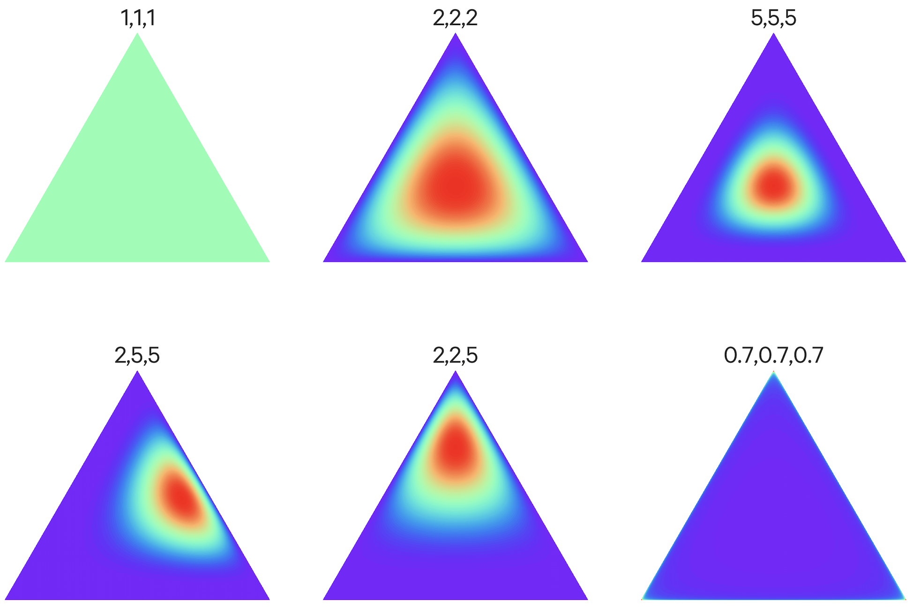

% Topic Models
% Marco Zocca
% December 13, 2018

# Outline

A review of three landmark methods from the topic modeling literature

- LSI
- pLSI
- LDA

# Latent Semantic Indexing (LSI)

\begin{table}[h]
\begin{tabular}{ r|c|c|c }
\multicolumn{1}{r}{}
 &  \multicolumn{1}{c}{Word1} & \multicolumn{1}{c}{Word2} & $\cdots$ \\
\cline{2-4}
Document1 & 3 & 1 & $\cdots$ \\
\cline{2-4}
Document2 & 2 & 0 & $\cdots$ \\
\cline{2-4}
$\cdots$ & $\cdots$ & $\cdots$ & $\cdots$ \\
\end{tabular}
\caption{Word counts for each document}
\end{table}

LSI : Identify a subspace that captures most of the variance in the document collection

Rank $r$ SVD factorization of the count data : $A \approx A' \triangleq U \Sigma V^\top$ where $\Sigma \triangleq diag(\sigma_1, \cdots \sigma_r)$

Document similarity : project test document onto column of $V^\top$ that corresponds to largest singular value

# Probabilistic LSI (pLSI)

Introduce _topics_ $z_k$

Each word is sampled from a mixture model $p(w) \triangleq \sum\limits_k p(w|z_k) p(z_k)$

Word-document _joint distribution_ $p(w, d) \triangleq \sum\limits_k p(w|z_k) p(d|z_k) p(z_k)$

Overparametrized $\rightarrow$ inference by iterative approximation (such as EM).

Caution : both in LSI and pLSI the number of parameters is linear in the size of the corpus. 

# Latent Dirichlet Allocation (LDA)

One level further up : documents represented as mixtures of topics

Generative model:

1. For each document:
    * Sample topic mixture $\bar{\theta} \sim Dirichlet(\bar{\alpha})$
    * For each word $\{w_i \cdots w_N \}$ in a document :
        * Sample topic $z_n \sim Multinomial(\bar{\theta})$
        * Sample word $w_n \sim p(w_n|z_n, \bar{\beta})$, multinomial conditioned on topic $z_n$

Hp:

- Topic dimensionality $k$ fixed
- Word probabilities $\beta_{i,j} \triangleq p(w_j | z_i)$ fixed, to be estimated

# Dirichlet process

{ width=250px }

$\bar{\theta} \sim Dirichlet(\bar{\alpha})$

$p(\bar{\theta} | \bar{\alpha}) = p(\theta_1, \cdots \theta_K | \alpha_1, \cdots \alpha_K) = \frac{1}{B(\bar{\alpha})} \prod\limits_{i=1}^K \theta_i^{\alpha_i - 1}$

$\theta_i \in (0, 1), \sum\limits_i \theta_i = 1$

# LDA

Joint p.d.f. : $p(\theta, z, w|\alpha, \beta) \triangleq p(\theta|\alpha) \prod\limits_n p(z_n|\theta) p(w_n|z_n, \beta)$

Posterior p.d.f. by rewriting the above via Bayes' Theorem :

$$p(\theta, z|w, \alpha, \beta) = \frac{p(\theta, z, w | \alpha, \beta)}{p(w|\alpha, \beta)}$$  

where 

$p(w|\alpha, \beta)$ is obtained by marginalizing the JPDF over $z$ and $\theta$:

$$p(w|\alpha, \beta) \triangleq \bigintsss p(\theta|\alpha) \left( \prod\limits_n \sum\limits_{z_n} p(z_n|\theta)p(w_n|z_n, \beta)\right) d\theta$$  \qquad \tiny{GNARLY}

# LDA

Inference:

- Original approach (Blei 2003) uses a variational formulation
    - minimize relative entropy between approximate variational family and true posterior

- MCMC based: collapsed Gibbs sampling (Griffiths 2004)
    - $z$ is a sufficient statistic for $\theta$ and $w$
    - Refer to (Darling 2011) for full details
    - Streaming, sparsity-based optimizations in later literature

# References

- T. Hofmann, Probabilistic Latent Semantic Analysis

- D. M. Blei, A. Y. Ng, M. I. Jordan, Latent Dirichlet Allocation, JMLR 2003

- T. L. Griffiths, M. Steyvers, Finding Scientific Topics, PNAS 2004

- W. M. Darling, A theoretical and practical implementation tutorial on topic modeling and Gibbs sampling, 2011

